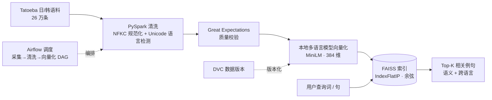

# 数据工程学习与实践

从零搭建生产级数据管道的学习与实践仓库，覆盖 ETL 开发、分布式计算、工作流调度、数据质量与数据版本管理，并延伸到**向量检索 / RAG**。

包含两个端到端项目 + 完整学习历程（Phase 1 → Phase 3）：

1. **多语言语料语义检索管道（RAG · 日/韩）** — 采集 → 清洗 → 校验 → 向量化 → 语义检索，Airflow 调度 + DVC 版本
2. **电商退款分析 ETL 管道** — PySpark 分布式清洗 / 加盐法解数据倾斜 / 入库 / 质量校验 / Airflow 调度

## 技术栈

| 类别 | 技术 |
|------|------|
| 数据处理 | Pandas、NumPy、PySpark |
| 向量检索 / RAG | sentence-transformers、FAISS、Milvus、语义检索 |
| 存储 | MySQL（SQLAlchemy / JDBC） |
| 工作流调度 | Apache Airflow |
| 数据质量 | Great Expectations |
| 版本管理 | Git、DVC |
| 语言 | Python 3.12、SQL |

---

## 项目一：多语言语料语义检索管道（RAG · 日/韩）

为自研 Chrome 扩展 **LingSnap**（日/韩/英划词翻译 + 语法分析）提供**离线例句检索**能力：用户查一个词或语法，返回语义最相关的真实例句，并支持跨语言检索。

### 架构 / 数据流



### 关键实现

- **分层数据管道**：Tatoeba 采集（26 万条）→ PySpark 清洗（NFKC 全角转半角 + 基于 Unicode 码点范围的语言检测 UDF）→ Great Expectations 质量校验，按 `raw / cleaned` 分层落地
- **向量化**：本地开源多语言模型 `paraphrase-multilingual-MiniLM-L12-v2`（384 维，不调 API → 成本 / 离线 / 隐私），向量归一化后落盘 `.npy`，与向量库解耦
- **语义检索**：FAISS `IndexFlatIP` + 归一化向量 = 余弦相似度，实现语义检索与**跨语言检索**（如日语「ありがとう」召回韩语「감사합니다」）
- **技术选型**：原型用 Milvus 验证方案，真实规模下遇 milvus-lite 稳定性瓶颈，权衡 Docker Milvus 与 FAISS 的资源 / 复杂度后选用 FAISS 落地，并预留向 Milvus 迁移方案
- **调度与版本**：Airflow 编排 采集→清洗→向量化 DAG（失败重试 + 告警回调 + 定时调度）；DVC 对 26 万语料与 386MB 向量做数据版本管理

相关代码：`projects/rag-semantic-retrieval/`（`ingest.py` 采集 · `clean_validate.py` 清洗+校验 · `vectorize.py` 向量化 · `search.py` 语义检索）、`airflow/dags/phase3_day8_airflow_dvc.py`（调度 DAG）

---

## 项目二：电商退款分析 ETL 管道

一条端到端的生产级数据管道，每日分析电商退款数据（退款品类分布、异常店铺、退款率）。

**数据流程：**

```
CSV 原始数据 → PySpark 清洗 → 聚合计算 → MySQL → 数据质量验证 → Airflow 调度
```

**关键实现：**

- **分布式 ETL**：PySpark 完成清洗、聚合，支持大数据量
- **数据倾斜处理**：针对单店铺占比过高（40%）的倾斜问题，采用**加盐法（Salting）两阶段聚合**打散热点 key
- **数据入库**：PySpark JDBC 写入 MySQL 结果表
- **数据质量验证**：Great Expectations 声明式规则，自动校验并生成报告，异常时告警
- **自动化调度**：Airflow DAG 每日定时触发，支持失败重试与告警回调
- **工程规范**：配置隔离（Config 类）、自定义异常、双通道日志、命令行参数（argparse）

相关代码：`projects/ecommerce-refund-etl/`（`refund_etl.py` ETL 主脚本 · `refund_config.py` 配置/日志/异常 · `generate_refund_data.py` 造数据）、`airflow/dags/refund_pipeline.py`（调度 DAG）

---

## 项目结构

```
.
├── projects/                              # 两个端到端项目（作品）
│   ├── rag-semantic-retrieval/            # RAG 语义检索管道
│   │   ├── ingest.py                      #   语料采集（落地 raw 层）
│   │   ├── clean_validate.py              #   PySpark 清洗 + GX 校验
│   │   ├── vectorize.py                   #   本地模型向量化（幂等）
│   │   └── search.py                      #   FAISS 语义检索
│   └── ecommerce-refund-etl/              # 电商退款 ETL 管道
│       ├── refund_etl.py                  #   ETL 主脚本（清洗/加盐聚合/入库/验证）
│       ├── refund_config.py               #   配置类 + 自定义异常 + 日志
│       └── generate_refund_data.py        #   造带倾斜/脏数据的测试数据
├── airflow/dags/                          # Airflow DAG（Airflow 要求集中放此目录）
│   ├── phase3_day8_airflow_dvc.py         #   RAG 语料管道调度（采集→清洗→向量化）
│   └── refund_pipeline.py                 #   退款管道调度（ETL → 质量验证）
├── data/                                  # 数据（大文件由 DVC 管理，git 只存 .dvc 指针）
├── dvc.yaml                               # DVC 管道定义（管道即代码）
└── learning/                              # 学习历程（按天，含 SQL 练习与各阶段笔记）
    ├── phase1/   # Pandas / NumPy / SQLAlchemy / ETL
    ├── phase2/   # PySpark / Airflow / Great Expectations / DVC
    ├── phase3/   # 向量化 / Milvus 入门
    └── sql/      # JOIN / 子查询 / CTE / 窗口函数 / 索引优化
```

## 快速开始

```bash
# 安装依赖
pip install -r requirements.txt

# 注：脚本使用相对路径 data/…，请在仓库根目录下运行

# —— 项目一：RAG 语义检索 ——
python projects/rag-semantic-retrieval/ingest.py          # 采集语料
python projects/rag-semantic-retrieval/clean_validate.py  # 清洗 + 质量校验（需设 PYSPARK_PYTHON）
python projects/rag-semantic-retrieval/vectorize.py       # 向量化（幂等，向量已存在则跳过）
python projects/rag-semantic-retrieval/search.py          # 语义检索

# —— 项目二：电商退款 ETL ——
python projects/ecommerce-refund-etl/generate_refund_data.py            # 生成测试数据
python projects/ecommerce-refund-etl/refund_etl.py --date 2025-06-01 --step all   # 运行 ETL（可分步 extract / validate）

# —— 数据版本（DVC）——
dvc pull    # 拉取被 DVC 管理的数据（需配置远程存储）
```

> 运行 PySpark 需将 `PYSPARK_PYTHON` / `PYSPARK_DRIVER_PYTHON` 指向虚拟环境的 Python；退款项目入库需 MySQL JDBC 驱动。

## 学习内容覆盖（Phase 1 → 3）

- **SQL**：多表 JOIN、子查询、CTE、窗口函数、索引与 EXPLAIN 优化
- **Python 数据栈**：Pandas 清洗/聚合、NumPy 向量化、SQLAlchemy、命令行 ETL、代码重构
- **PySpark**：DataFrame API、分区与 Shuffle、数据倾斜与加盐法
- **Airflow**：DAG、Operator、任务依赖、重试、Sensor、Hook、告警
- **数据质量**：Great Expectations 声明式验证、Checkpoint、报告
- **版本管理**：DVC 数据版本控制、dvc.yaml 管道、远程存储
- **向量检索 / RAG**：sentence-transformers 向量化、FAISS / Milvus、语义与跨语言检索、选型权衡
